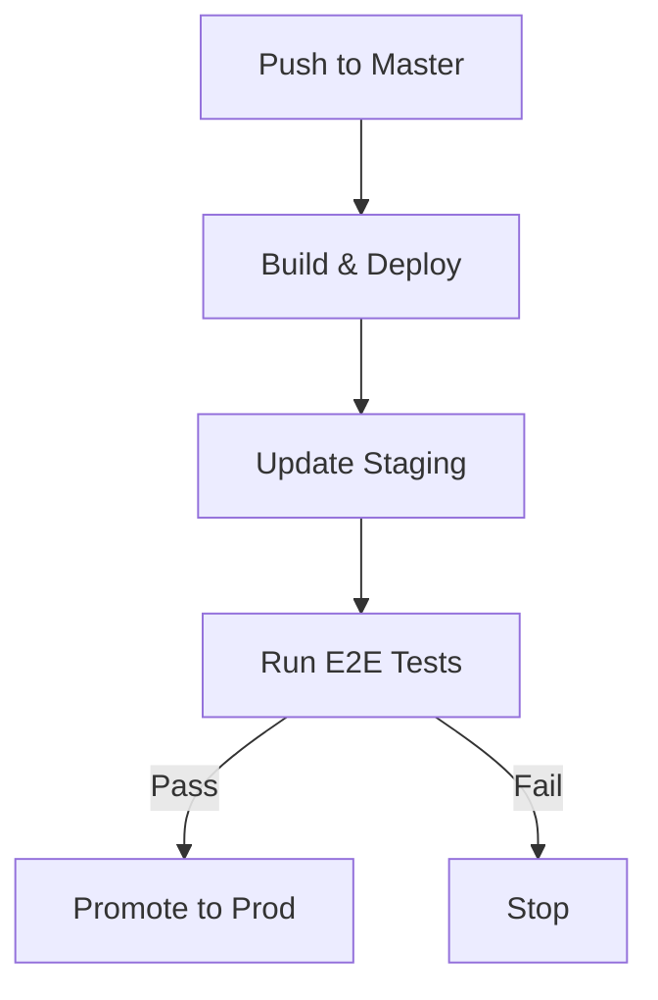

# GitHub Actions Workflows

This directory contains the CI/CD workflows for the Ruggine URL shortener service. The workflows implement a GitOps deployment strategy with staged environments and automated testing.

## Workflows

### 1. Build and Deploy Docker Image (`docker-deploy.yaml`)
Triggered on push to master branch.

**Purpose:**
- Builds the Rust application
- Creates and pushes Docker image
- Updates staging environment

**Key Features:**
- Uses ARM64 runners for native builds
- Multi-stage Docker builds for optimization
- Automatic staging deployment via GitOps
- GitHub Container Registry integration

### 2. E2E Tests and Production Promotion (`e2e-and-promote.yaml`)
Triggered after successful `docker-deploy.yaml` completion.

**Purpose:**
- Tests staging environment
- Promotes to production if tests pass

**Process:**
1. Waits for staging to be ready
2. Runs E2E tests:
   - Valid URL redirect test
   - Invalid URL handling test
3. If tests pass:
   - Gets image tag from staging
   - Updates production configuration
   - Commits changes via GitOps

## Deployment Flow

## Infrastructure Integration

- Uses GitOps principles
- No direct cluster access
- All changes through git commits
- ARM64 optimized builds
- Separate staging/prod environments

## Usage

The workflows run automatically on push to master. No manual intervention required unless:
- E2E tests fail
- Manual production rollback needed
- Infrastructure changes required

## Runner Requirements

Both workflows use ARM64 runners (`ubuntu-24.04-arm`) for:
- Native ARM64 builds
- Better performance
- Reduced resource usage
